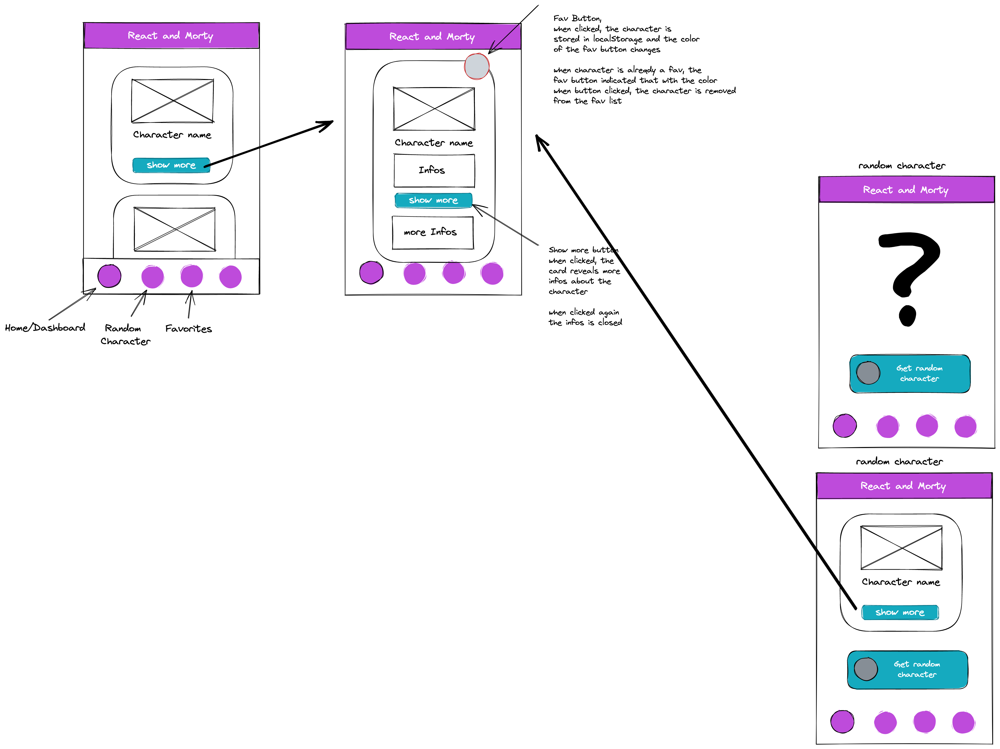

# React and Morty

> "The only way to learn a new programming language is by writing programs in it."  
> -- <cite>Dennis Ritchie</cite>

## What we are going to build

This repo contains the Rick and Morty in React exercise. Use this as a template.

We will create a React app to render characters from the Rick and Morty API. You will be able to save characters as favorites, see detailed information on a separate page and you can get random characters.

See a scribble for a simple overview:

See final example app [here](https://react-and-morty-eight.vercel.app/)

## Learning Objectives

- git & GitHub workflow
- using [issues](https://docs.github.com/en/issues/tracking-your-work-with-issues/about-issues) and a [board](https://docs.github.com/en/issues/organizing-your-work-with-project-boards/managing-project-boards/about-project-boards) to organize tasks
- learn to build a multipage react application
- how to break down a big problem in solvable smaller problems
- coding, coding, coding

### You will use the following stack

- react with useState & useEffect hooks
- styled-components
- react-router
- ES6 Features
- fetching data from an external API
- storing data in localStorage
- logic

## Recources:

- [Rick and Morty API Docs](https://rickandmortyapi.com/documentation/#rest)
- [useState](https://reactwithhooks.netlify.app/docs/hooks-state.html)
- [useEffect](https://reactwithhooks.netlify.app/docs/hooks-effect.html)
- [react-router](https://reactrouter.com/docs/en/v6/getting-started/tutorial)

HAVE FUN

> "Wubba lubba dub dub"  
> -- <cite>Rick Sanchez</cite>
